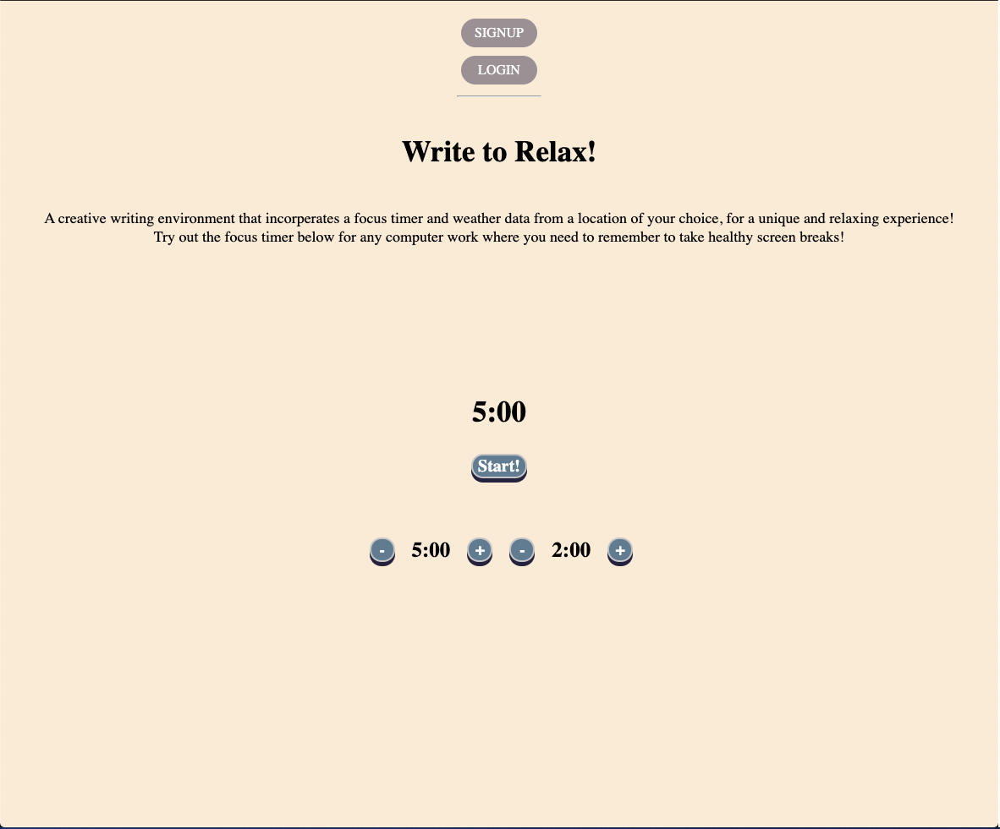
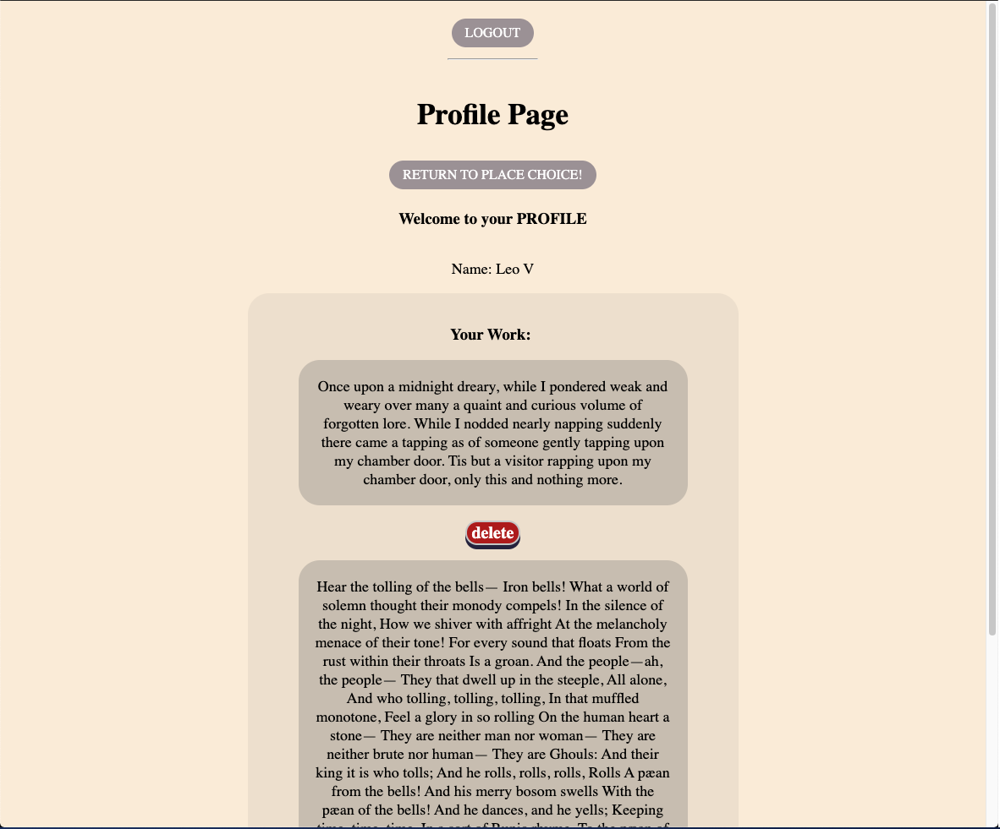
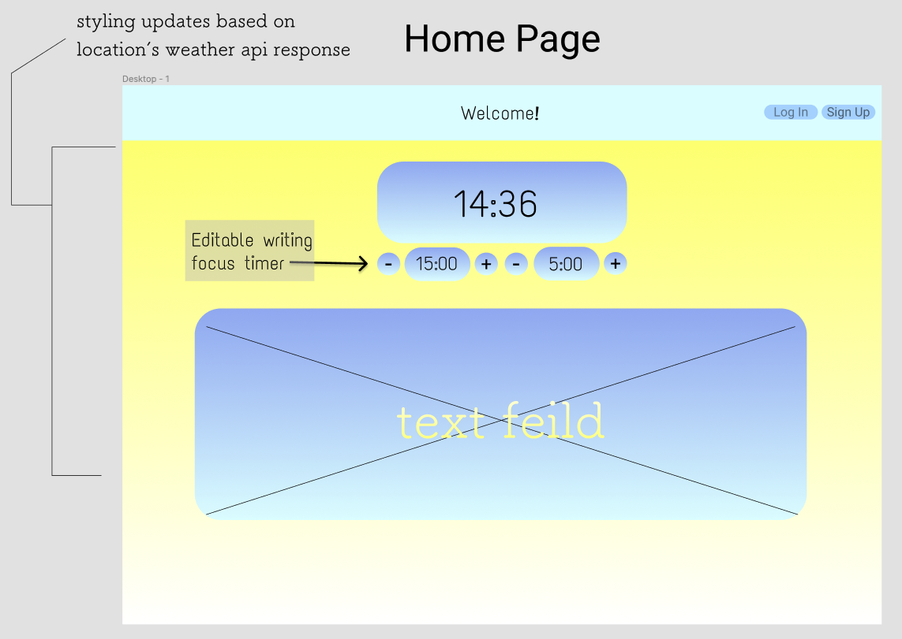
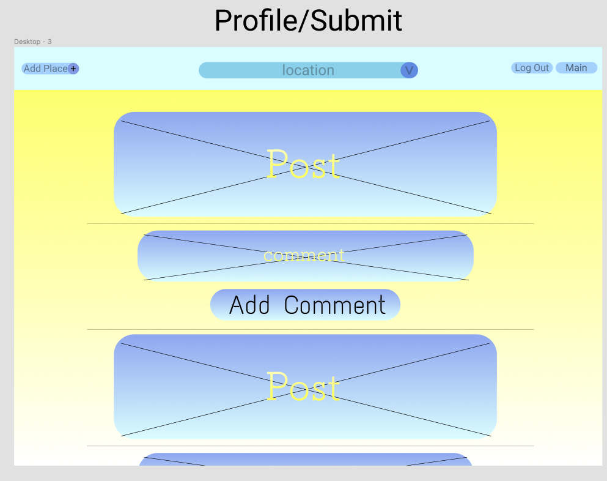

# Write to Relax

### Let's relax in a comforting creative writing evironment that increases focus by encouraging healthy screen breaks. With styling that updates based on the weather api of the user's location; this writing focus app brings the outside in a small way to help them feel connected to the majestic outdoors!

***
___

## Motivation

I've always enjoyed creative writing but I have difficulty focusing or finding the inspiration to get started. I've explored using various creative writing apps but was always just not quite satisfied with what I found. So what better way of finding an ideal app than making one myself?! I also have a deep love for the out doors and when I spend long hours indoors infront of screens; even a taste of outside is appreciated.    

***
---

## Screenshots

***
---

## User Stories and Wire Frames

### Home Page:
Landing page that a visitor will first see. Less functionality but still has access to a timer and text feild.

---
### Main Page (logged in):
Added functionality of location drop-down menu, submit button to save/post text, and a button to access your profile.

---
### Sign In Form Page:
Page with form for users to sign back in.

---
### New User Form Page:
Sign up page for new users!

---
### New Place Form:
Page with form for adding new places to the *global* location drop down menu.

---
### Profile: 
Page where the user can see all of their posts and comment sections for each.

---

### Routes:
All of the routes and how they link the pages together.

---
### Database:
ERD (Entity Relationship Diagram) for the Database.

---
***

## Installation:

- run npm install to install required technologies

- Seed database and migrate it with sequelize